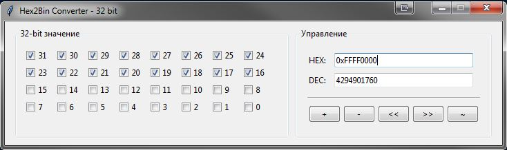

# Hex2Bin Converter — 32 bit

A GUI tool for visualising and editing a 32-bit unsigned integer as individual bits,
a hexadecimal field, and a decimal field.

## Requirements

- Python 3.8+
- Standard library only (tkinter, sys) — no third-party dependencies

## Usage

```bash
python hex2bin.py
```

## Features

- **Bit-level editing** — 32 individual checkboxes (bits 31..0) arranged in four rows of eight
- **HEX input** — enter a value with or without the `0x` prefix and press Enter
- **DEC input** — enter a decimal value and press Enter
- **Arithmetic / logic buttons:**

  | Button | Operation |
  |--------|-----------|
  | `+`    | Increment by 1 (wraps at 2³²) |
  | `-`    | Decrement by 1 (wraps at 0) |
  | `<<`   | Logical shift left by 1 bit (MSB discarded) |
  | `>>`   | Logical shift right by 1 bit |
  | `~`    | Bitwise inversion of all 32 bits |

- All controls stay synchronised on every change

## Interface



---

## Changelog

| Version | Date       | Changes         |
|---------|------------|-----------------|
| 1.0.0   | April 2026 | Initial release |

---

*Document version: 1.0*
